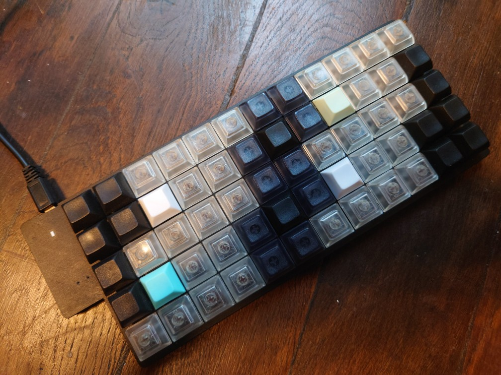

# Midi grid [](https://travis-ci.com/TeXitoi/midi-grid)

A firmware for [Keyberon grid
60](https://github.com/TeXitoi/keyberon-grid) to make a midi
keyboard. The layout is an isomorphic layout similar to the
[Striso](https://www.striso.org/), which is similar to the
[Wicki-Hayden
layout](https://en.wikipedia.org/wiki/Wicki%E2%80%93Hayden_note_layout).



## Compiling and flashing

For easy dfu flashing without a ST-Link v2, we use the [STM32duino
bootloader](https://github.com/rogerclarkmelbourne/STM32duino-bootloader/).

First, install all the needed software:

```shell
curl https://sh.rustup.rs -sSf | sh
rustup target add thumbv7m-none-eabi
sudo apt-get install dfu-util
```

Compile the firmware:

```shell
cd midi-grid
cargo objcopy --release -- -O binary midi-grid.bin
```

Then, install the bootloader on the blue pill. After connecting the
blue pill with the ST-Link to the computer, type:

```shell
cd midi-grid
openocd -f interface/stlink-v2.cfg -f target/stm32f1x.cfg -c "init; reset halt; stm32f1x mass_erase 0; program generic_boot20_pc13.bin exit 0x08000000"
```

Remove the ST-Link v2 and plug the blue pill with a USB cable to your
computer. It should now be in DFU mode. Now, flash the firmware:

```shell
cd midi-grid
sudo dfu-util -w -d 1eaf:0003 -a 2 -D midi-grid.bin
```
